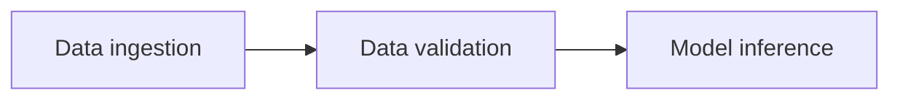
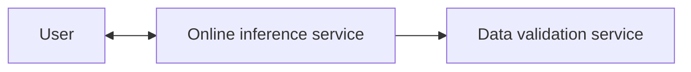

# Data validation for inference

During our training workflow we produce the data validation artifact which describes the data schema and the dataset distribution, see [training workflow](training_workflow.md). Now during serving we want to validate that our serving data has the same data schema and comes from a similar distribution to our training data in order to avoid training-serving skew. Comparing distributions can be done with measures such as [Jensen–Shannon divergence](https://en.wikipedia.org/wiki/Jensen%E2%80%93Shannon_divergence).

Below we describe how to do this validation for batch & online inference.

## Batch inference

A typical batch-inference workflow has the following structure:

In the data validation task we will perform the validation. That is, compare the data schema for the ingested data for inference and the produced data schema during training. We will also compare the data distribution between the two datasets. If the schemas & data distributions are the same we will continue to the model inference task, otherwise we might fail the workflow and/or notify the developers that something is wrong.

## Online inference

Doing the data validation for online inference is a bit trickier. First of, most metrics to detect distribution differences requires a sizeable amount of data. For online inference we might only have at hand one or a couple of data-points (i.e. batched requests) at hand and computing this difference is not meaningful. Also doing this data validation would introduce more latency to our system since it's an additional step we need to perform.

So how can we solve this? One approach is take the requests we get in the online inference service and forward them to an additional service, called data validation service. Here we will store the requests and once we have reached an adequate amount of data we will trigger a batch data validation job where we compare the data schema and distribution for these requests with the ones produced by the training workflow. If the schema & data distribution are different, we will notify the developers that something is wrong. We could also run this as a cron job such that we do the data validation on new requests every X hours or days.

Furthermore, if the amount of requests is large we could sample these requests randomly such that we only do the data validation on a percentage of the requests.

Below is an overview of this architecture:

## Distribution skew versus drift

Training-serving skew occurs when the data distributions for training and serving is different from the beginning. As an example, imaging that one of our input feature is the price of a product. During training, we have assumed that the price is in Euros. However, during serving we accidentally input prices in USD, which causes the price feature to have different distributions between training and serving.

Sometimes however the distributions are the same in the begging but drifts apart over time. Imagine the price feature described above. Now instead assume that the price is in Euros for both training and serving. But due to inflation, the prices increases over time. Therefore, the distributions drifts apart, causing model performance to degrade. This is called a distribution drift.

## Metrics to determine distribution skew / drift

In a supervised learning setting, we are typically trying to estimate $P(Y|X)$ where $X$ is our features and $Y$ is the target. That is, we are trying to estimate the probability distribution of the target variable, given our features. For a classification problem, we get the discrete probability distribution over the class given a feature input.

Using Bayes' theorem we get that:

$P(Y|X) = \frac{P(X|Y) P(Y)}{P(X)}$

Now, if any of the probabilities $P(Y|X)$, $P(X|Y)$, $P(Y)$ or $P(X)$ changes between training and serving the model performance usually degrades. Since $P(X|Y)$ is neither estimated during training or observed directly it's usually skipped for monitoring distribution drifts. So during serving we cam compare:

- $P(X)$, called covariance drift.
- $P(Y)$, called label drift.
- $P(Y|X)$, called concept drift.

The difference in $P(X)$ between training and serving can always be compared since we observe the features before being send into our model.

$P(Y)$ and $P(Y|X)$ is a bit more tricky to observe potentially. This is because we need access to the ground truth of the target values, which is not always possible to obtain. This usually depends on the task at hand. Imaging the following two systems:

A machine learning system that is trying to predict whether a user will click on an ad or not. Now in our internal system, we will most likely keep track of whether the user clicked on it or not. Therefore we can estimate $P(Y)$ and $P(Y|X)$ and compare it between training and serving.

A machine learning system trying to predict whether an image is a dog or a cat. Now unless the user gives us feedback on if the image was correctly labelled or not, we cannot determine the ground truth. Therefore, estimating $P(Y)$ and $P(Y|X)$ during serving will be impossible, unless we label the incoming images ourself.
