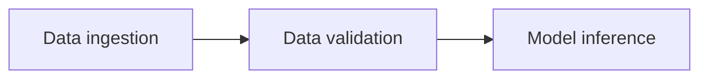
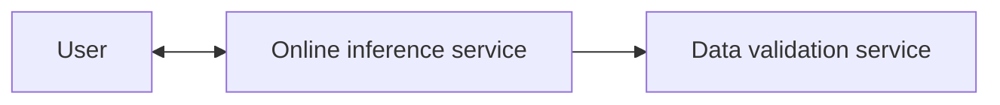

# Data validation for inference

During our training workflow we produce the data validation artifact which describes the data schema and the dataset distribution, see [training workflow](training_workflow.md). Now during serving we want to validate that our serving data has the same data schema and comes from a similar distribution to our training data in order to avoid training-serving skew. Comparing distributions can be done with measures such as [Jensen–Shannon divergence](https://en.wikipedia.org/wiki/Jensen%E2%80%93Shannon_divergence).

Below we describe how to do this validation for batch & online inference.

## Batch inference

A typical batch-inference workflow has the following structure:

In the data validation task we will perform the validation. That is, compare the data schema for the ingested data for inference and the produced data schema during training. We will also compare the data distribution between the two datasets. If the schemas & data distributions are the same we will continue to the model inference task, otherwise we might fail the workflow and/or notify the developers that something is wrong.

## Online inference

Doing the data validation for online inference is a bit trickier. First of, most metrics to detect distribution differences requires a sizeable amount of data. For online inference we might only have at hand one or a couple of data-points (i.e. batched requests) at hand and computing this difference is not meaningful. Also doing this data validation would introduce more latency to our system since it's an additional step we need to perform.

So how can we solve this? One approach is take the requests we get in the online inference service and forward them to an additional service, called data validation service. Here we will store the requests and once we have reached an adequate amount of data we will trigger a batch data validation job where we compare the data schema and distribution for these requests with the ones produced by the training workflow. If the schema & data distribution are different, we will notify the developers that something is wrong. We could also run this as a cron job such that we do the data validation on new requests every X hours or days.

Furthermore, if the amount of requests is large we could sample these requests randomly such that we only do the data validation on a percentage of the requests.

Below is an overview of this architecture:

