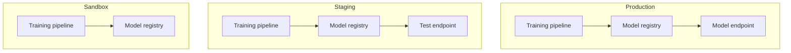
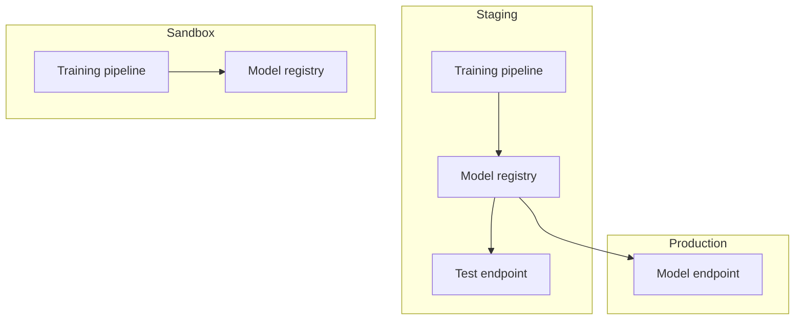

# Infrastructure setup

## Different environments

## Promotion to production

```mermaid
graph TB
    subgraph Production
    H[Training pipeline] --> G[Model registry]
    G --> J[Model endpoint]
    end
    subgraph Staging
    D[Training pipeline] --> E[Model registry]
    E --> F[Test endpoint]
    end
    subgraph Sandbox
    A[Training pipeline] --> B[Model registry]
    end
```

```mermaid
graph TD
    subgraph Staging
    D[Training pipeline] --> E[Model registry]
    E --> F[Test endpoint]
    end
    subgraph Production
    E --> H[Model endpoint]
    end
    subgraph Sandbox
    A[Training pipeline] --> B[Model registry]
    end
```
