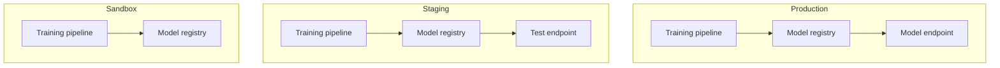
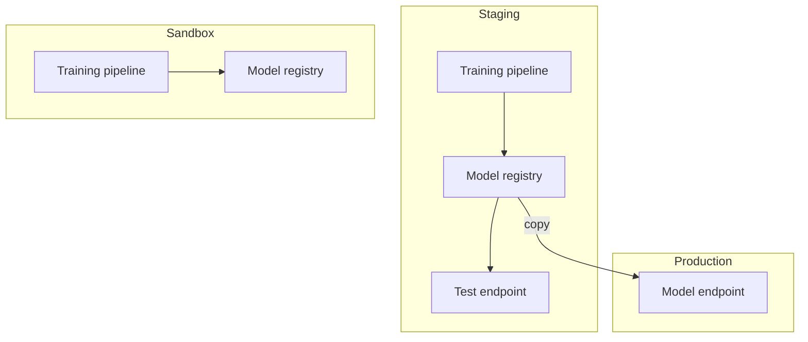

# Infrastructure setup

Developing machine learning models requires a lot of trial and error. For example, we might try different features, model architectures and so on. However, while having models in production we also want to separate these environments such that we don't accidentally make changes in production, which can cause an outage of our service. Therefore it's recommended to separate these clearly.

The different environments should also be completely separated. This includes model serving, feature creation job, training jobs and so on.

What do we mean by environments here? In Google Cloud & Amazon Web Services this could be different projects. In kubernetes this could be different namespaces.

## Different environments

### Sandbox

The sandbox environment is used for testing out new ideas where we are unsure whether they will work out or not. For example, we might introduce a new feature that we hope will increase the accuracy of the model. This would require us to change the feature creation job, as described in [Decoupling feature creation from training & serving workflow](decouple_feature_creation.md). Now this could cause issues if we accidentally introduce a bug into the job if we ran it in the production environment. Therefore, it's recommended to try these experimental changes in our sandbox environment.

### Staging

The staging environment is simply used to verify changes before they go into production. Staging should mirror production as much as possible.

### Production

Production is used to serve actual users. For example, let say you have a model that serves recommendation for a video sharing site. When a user opens the app and sees video recommendations these comes from our production environments.

Before changes goes into production we should be sure that they work, which we should test in staging.

## Promotion to production

If this would have been a non machine learning service, we could simply deploy the code to production. What makes machine learning products a bit more complicated is that we have two parts that needs to go into production, code and a trained model. So how can we do this?

There are two common patterns for this:

### Completely separated

Here we have completely separated staging & production. This means that we will train our model in staging for testing. If everything works as expected, we can run the training workflow again in production in order to get the production model, which will be used for serving. Below is a overview of this setup:

The drawback of this approach is that we need to train the model twice, once in staging and once in production. If the training job is computationally heavy this can become expensive. The advantage is that we have two completely separate environment, making accidental changes less likely.

### Transit model from staging to production

The other approach is to train the model in staging. Furthermore, we will validate that the model works as expected in staging. Once we are confident that the model is works as we want, we can transfer the model into the production environment (with the corresponding serving code). Once in production, it will be used for serving.

The drawback is that we couple staging & production; however we only need to train the model once.
