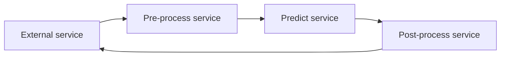

# Online serving structure

When deploying our machine learning model for online inference we typically divide into two parts, our backend service and our machine learning inference service. Below is a diagram of the high-level overview of this setup:


Our backend service is responsible authenticate the request, fetching necessary data from the feature store etc. The machine learning inference service will be tasked with doing the actual inference of the machine learning model. It can be broken up into three parts; pre-process, predict and post-process. 

The pre-process step include steps like validating that the required data is available for doing the request, that the data types are correct etc. We try to avoid including model specific pre-processing step here, see [Embed pre & post processing logic in the model](embedd_processing_logic_model.md) for clarification.

The predict part is where we do the actual model inference. We send in the data produces from pre-process step into the model to get the predictions.

Lastly, we have the post-process step. Here we transform the outputted predictions into a format which can be used by the system as a whole. For example, we might transformed predicted class-ids into class names, such as 0 into the name 'Dog'.

Now with these tree steps, how should they be deployed? As one service or spread out into multiple? There is a few different approaches for doing this which we will delve into now with their own advantages and disadvantages.

## Group all steps together in one service

The first approach we will discuss is to group all the steps into one service. Below is an example code structure:

```python
class InferenceHandler:
    def __init__(self, model_path):
        # load the model, e.g. with pickle
        pass

    def pre_process(self, x):
        # define the pre-process logic in this function
        pass

    def predict(self, x):
        # define how the model's predict function should be called in this function
        pass

    def post_process(self, x):
        # define the post-process logic in this function
        pass

    def infer(self, x):
        # in this function we glue all of the above step together
        return self.post_process(self.predict(self.pre_process(x)))
```

The class above would then be included in a web-server which exposes an end-point that allow users to call it through HTTP or gRPC.

The advantages of this approach that it is simple. You only need to deploy one service, making the deployment process a lot smoother. Furthermore, keeping the different steps in synchronisation is a lot easier. For example, imaging we wanted to update our predict function to accept batches of inputs (i.e. from input shape of (num_features) to (num_samples, num_features)). This change would require us to also update the pre & post-processing steps. Now, if these were deployed separately, we would need re-deploy all the services which is more cumbersome.

[VertexAI model serving](https://github.com/googleapis/python-aiplatform/blob/main/google/cloud/aiplatform/prediction/sklearn/predictor.py) and [Ray Serve](https://docs.ray.io/en/latest/serve/index.html) are examples of frameworks that uses this approach.

## Separate each step into a service

The next approach is to separate each step into a service. These would then communicate over HTTP / gRPC. Below is a diagram of the communication flow:



Now you might ask "why would we want to do this"? To answer that question, lets imagine the following case-study:

Let's say we have a large convolutional neural network that we want to deploy. To speed up the inference part we decide to run the model on a GPU. Furthermore, our pre-processing step is quite time-consuming, e.g. we want crop the image and convert from [RGB](https://en.wikipedia.org/wiki/RGB_color_model) to [HSV](https://en.wikipedia.org/wiki/HSL_and_HSV). Moreover, let's say we are getting an increase in request so we need to scale-up this solution. If all the steps are grouped together, we need deploy additional replicas of the same service, regardless of which part is the bottleneck. Furthermore, during the pre & post-processing step our GPU is idle which is wasteful since GPU's are expensive. Now imagine these were separate steps, then we could scale them separately depending on which part was the bottleneck.

Another advantage of this separation is that we can co-locate our models on a model inference server, such as [triton-inference-server](https://github.com/triton-inference-server/server) and [tensorflow serving](https://github.com/tensorflow/serving). Now we could load multiple replicas of a model and/or multiple models. This is advantages since it allow us to utilize our GPU better.

Lastly, most of these inference servers allows us to off-load models that haven't been used in a while, and load it once a request comes for that specific model (of course with a latency cost). This feature can be helpful if we need to serve a large number of models. For example, imagine that we have a model that forecasts how much we will sell of an item in a given country. Through our experiments we have determined that having one model per country performed better then a global one. Furthermore, assume that we operate in many different countries. If we have included all steps in one service, we would have to deploy one of these services for each country (and potentially more if the number of requests are large). However when the steps are separated, we could co-locate all of the models on an inference server, potentially getting away with fewer deployments.

[Kserve](https://github.com/kserve/kserve) and [Seldon](https://github.com/SeldonIO/seldon-core) are examples of frameworks that uses this approach.

## When to use which approach?

So now naturally the question arises: "Which of these approaches should I take?"

I would choose "grouping all steps together" if the following condition were meet:

- Number of served models are small for the application
- The model doesn't require an accelerator, such as GPUs, TPUs etc

Otherwise I would go "separate each step".
