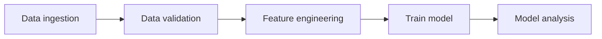

# Training workflow

A common structure for a training pipeline is visualized below:

I first saw this structure in the [TFX project](https://www.tensorflow.org/tfx/guide), but it might originate somewhere else.

## Data ingestion

In this task we load the data needed for training our machine learning model from an external system, e.g. a feature-store or a data warehouse. Typically in this step we also split the data into separate sets: training, validation and test.

## Data validation

In this task we will validate that our data follows some pre-defined structure. One common case is that the data follows a given schema. For example, we might expects that:

- That the column 'prices' should be of type float and should not be negative.
- That the column 'country' should be of type string and can only have the following values: ['US', 'CA', 'MX']

During this step we can also compute statistics about the data, such as histogram of numerical columns. These statics will be useful during serving when are trying to detection training-serving skews.

We can also compare the distribution between the training set and the validation & test set. This can be useful to detection any issues creating when splitting the data. 

For example, image that we decide to train on data from users in USA and evaluate on data from users in Canada and Mexico. However, the behaviour of users in USA might be completely different from users in Canada and Mexico and therefore our model might perform poorly on the validation set. Comparing the distribution between training and validation can give us useful information how we need to change our splitting strategy.

## Feature engineering

In this task we will do the feature creation and the feature pre-processing.

By feature creation I mean constructing the actual features. For example, calculating a rolling average of bought items for a given users during the last 14 days. Note that in general we would like to do this outside of the training workflow, see [decoupling feature creation from training & serving workflow](decouple_feature_creation.md).

However there might be special cases where we have to do it in the training workflows. As an example, image that as part of the inference request we get a list of outlier days that the user has provided and we have a rolling average feature. In this case, we need to calculate the rolling average after removing the outliers, otherwise they will influence this feature. Since this feature needs to be calculated at "runtime" for inference it makes sense to do the same for training, allowing us to re-use the functionality and avoid skews.

But in general this should be avoided if possible, as described in [decoupling feature creation from training & serving workflow](decouple_feature_creation.md). And sometimes we could re-frame the feature to avoid having to compute it at "runtime". In the example above, we could potentially use median instead of mean to remove the need for the user to provide the outlier days.

The second part is feature pre-processing. Here we transform the features into a more desirable format. For example, we could transform a column of words to indices, Z-normalize a numerical column etc. A common pattern is to include this logic in the model, see [embed pre & post processing logic in the model](embedd_processing_logic_model.md).

However, we might do the pre-processing in this task and then embed this into the model at a later time. The reason why we might want to do that is because this processing can be computationally heavy, especially if there is a large amount of data. This is actually what [Tensorflow transform](https://www.tensorflow.org/tfx/transform/get_started) does.

## Train model

## Model analysis
