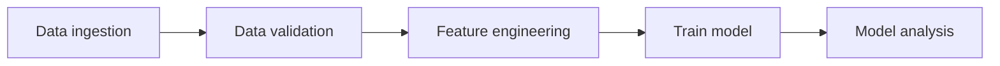

# Training workflow

A common structure for a training pipeline is visualized below:

I first saw this structure in the [TFX project](https://www.tensorflow.org/tfx/guide), but it might originate somewhere else.

## Data ingestion

In this task we load the data needed for training our machine learning model from an external system, e.g. a feature-store or a data warehouse. Typically in this step we also split the data into separate sets: training, validation and test.

## Data validation

In this task we will validate that our data follows some pre-defined structure. One common case is that the data follows a given schema. For example, we might expects that:

- That the column 'prices' should be of type float and should not be negative.
- That the column 'country' should be of type string and can only have the following values: ['US', 'CA', 'MX']

During this step we can also compute statistics about the data, such as histogram of numerical columns. These statics will be useful during serving when are trying to detection training-serving skews.

We can also compare the distribution between the training set and the validation & test set. This can be useful to detection any issues creating when splitting the data. 

For example, image that we decide to train on data from users in USA and evaluate on data from users in Canada and Mexico. However, the behaviour of users in USA might be completely different from users in Canada and Mexico and therefore our model might perform poorly on the validation set. Comparing the distribution between training and validation can give us useful information how we need to change our splitting strategy.

## Feature engineering

## Train model

## Model analysis
